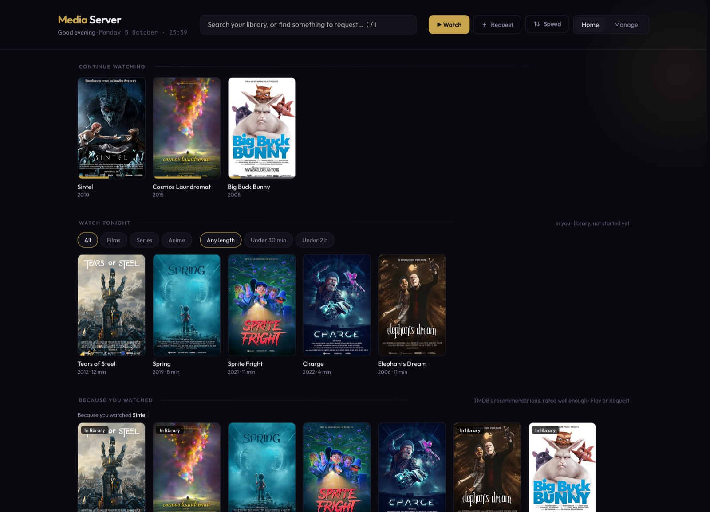
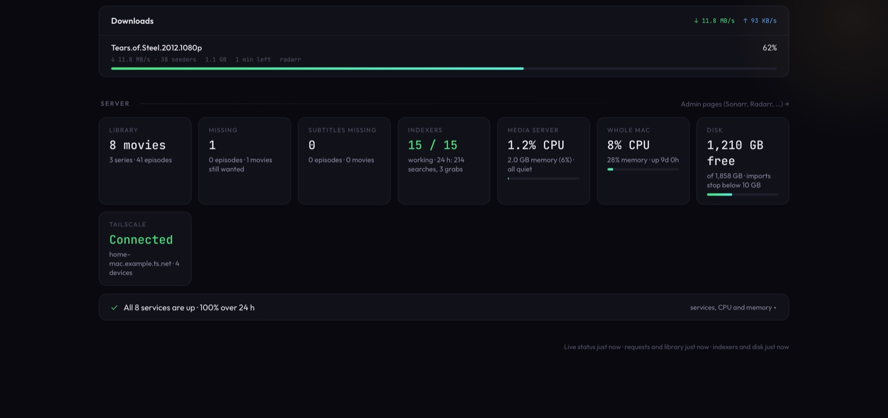

# Media Server

**Your own Netflix, on your Mac, set up with one command.** Ask for a film or a show and it's found, downloaded, checked, given subtitles and put in your library, ready to watch on your TV, phone, tablet or browser. No Docker, no VM, no subscriptions.



<sub>The dashboard with demo data. Posters: Blender Foundation's open movies, CC BY ([sources](docs/CREDITS.md)).</sub>

```bash
bash <(curl -fsSL https://raw.githubusercontent.com/unbalancedparentheses/media-server/main/install.sh)
```

It needs [Nix](https://determinate.systems/nix-installer/) first; see [Install](#install).

## What you get

|  |  |
|---|---|
| 📺 **Watch anywhere** | Jellyfin with the Moonfin app on Apple TV, Android TV, Fire TV, phones, tablets and the browser: profiles for the family, "Skip intro" and "Skip credits", hardware video conversion on Apple silicon, and downloads for the plane. |
| ➕ **Ask for anything** | Request in Moonfin, Seerr or the dashboard. Sonarr (TV, anime) and Radarr (films) find a good release, qBittorrent downloads it, and it appears in your library on its own. |
| 🧹 **Only good releases** | Fakes, disc images, upscales and foreign-subtitled releases are never grabbed. Smaller x265 files are preferred, anime comes with Japanese audio, and stalled downloads are replaced automatically. |
| ✅ **Every file checked** | Each new file is played through. One that's broken, a sample or a dub is replaced. Audio and subtitles are fixed so it plays directly everywhere, and Jellyfin is asked to stream it to prove it works. |
| 💬 **Subtitles** | English (or Spanish when there's no English) from free providers, and Blu-ray picture subtitles read into text. |
| 🖥️ **A Mac app** | The dashboard, Moonfin, Seerr and every admin page in one window, a Dock badge when something needs a look, and notifications when something is ready to watch. |
| 🛟 **Looks after itself** | It explains why a request isn't arriving and retries it, watches the disk and the connection, keeps the Mac awake while it's plugged in, and runs about 125 checks after every install. |

Everything runs natively as macOS launchd services built by Nix, and one command removes them all.

## Contents

- [Install](#install)
- [First steps](#first-steps)
- [The app and the dashboard](#the-app-and-the-dashboard)
- [Everyday use](#everyday-use)
- [Changing settings](#changing-settings)
- [Updates, backups, uninstall](#updates-backups-uninstall)
- [Troubleshooting](#troubleshooting)
- [Reference](#reference): commands, how it works, services, every setting, security, testing, files

## Install

**You need:** a Mac that stays on and plugged in (Apple silicon recommended; developed on an M-series Mac with macOS 26), about 10 GB free for the apps plus room for your library, and an internet connection.

1. **Install Nix** (skip if you have it), then open a new terminal:

   ```bash
   curl -fsSL https://install.determinate.systems/nix | sh -s -- install
   ```

2. **Install Media Server**: run the one-liner above (it clones the repo into `~/media-server` and starts setup), or by hand:

   ```bash
   git clone https://github.com/unbalancedparentheses/media-server.git
   cd media-server
   nix run .#install
   ```

3. **Choose passwords.** Setup asks for a Jellyfin username and password (also used for the admin pages) and a qBittorrent password. With `nix run .#install -- --yes` strong ones are generated and printed instead. They're saved in `~/media/config.toml`.

4. **Wait.** The first run often takes half an hour or more, because a few services are built from source. Later runs take a minute or two. Setup writes every service's settings, starts them (and again at every login), connects them to each other, builds the Mac app, runs its checks and prints the addresses to open. If the macOS firewall asks, allow at least Jellyfin and Seerr.

Run `nix run .#install` again whenever you like: it only changes what differs from `config.toml`. All `nix run .#…` commands run from the media-server folder (`~/media-server` if you used the one-liner).

## First steps

1. **Open Media Server** from the Dock and choose **Watch**. Log in with the Jellyfin username and password you chose; the app remembers it.
2. **Request something.** Search in Watch (Moonfin), in **Requests** (Seerr) or in the dashboard's search box, and press Request. It usually arrives within minutes to an hour, depending on how many people share the release.
3. **Install Moonfin on your devices** from the App Store, Google Play or Amazon. Enter `http://<mac-ip>:8096` as the server and log in. LG and Samsung TVs can sideload Moonfin, or use Litefin. To find the Mac's address, run `ipconfig getifaddr en0`.
4. **Add your family.** In Jellyfin (Dashboard → Users), create a user per person. Moonfin shows them as profiles, each with its own watch history. Their requests download right away; set `[requests] auto_approve = false` to approve them yourself in Seerr.

## The app and the dashboard

**Media Server.app** is in your Dock (and in `~/Applications`). It holds every page in one window:

| Toolbar | What it is |
|---|---|
| **Home** | The dashboard (below) |
| **Watch** | Moonfin, to watch |
| **Requests** | Seerr, to browse and request |
| **Sonarr · Radarr · Prowlarr · qBittorrent · Bazarr** | The admin pages (SABnzbd too when a Usenet provider is on). With `admin_bind = "127.0.0.1"` (this Mac only) they open without a login |

- **Switch** from the toolbar or with Cmd+1…9. Each page keeps its place while you're on another. Back/Forward (Cmd+[ / Cmd+]), Reload (Cmd+R), Find (Cmd+F, then Cmd+G) and zoom (Cmd+plus / minus / 0, remembered per page) work as in a browser. Links to other sites open in your browser.
- **Badge and notifications:** while the app runs (closing the window keeps it running; Cmd+Q quits), its Dock icon shows how many things need a look, or ↓ while something downloads. Notifications tell you when something is ready to watch, or when something newly needs a look: a stuck download, the disk filling up, a service down. Click one to open the page it's about. *Media Server → Open at Login* keeps them going after a restart. The **Server** menu restarts, stops or starts every service (Cmd+Shift+R restarts), and shows how many are running; stopped ones start again at the next login.
- It's built on your Mac with Xcode's Command Line Tools. Without them (`xcode-select --install`), it opens the dashboard alone in a browser window.

**The dashboard** (Home, or `http://localhost` on the Mac; it answers nowhere else, since it has no login and can delete titles):

- **Home:** search your library and everything you could request, in one box (press `/`). Below that: continue watching, *Watch tonight* (unstarted titles, filtered by type and length), *Because you watched* and *Worth watching* (well-rated new films, series and anime, each marked ▶ Play or ＋ Request), recently added, your requests with where each one is, and *Your library* with sizes and Delete.
- **Manage:** what needs attention and what to do about it; **Automation**: pause the searches for 24 hours or the file repairs until morning (each resumes on its own), and any **unfinished** work (a conversion mid-way, a deletion not finished, a fix being retried, downloads paused for space) with what's left and when it's tried again (`nix run .#doctor` lists the same); downloads with a speed limit switch, library health (files fixed, rejected, waiting for a better release), titles *not found for weeks* (delete a film, stop looking for a season, which deletes nothing, or pick a release by hand), and the server: services, disk, indexers, CPU and memory, Tailscale.



**Deleting** (the trash button on a poster, or Delete in *Your library*) removes the title through Radarr/Sonarr with its files, its torrents in qBittorrent, and its Seerr entry, so it can be requested again. For a series you choose the whole series or one season.

## Everyday use

- **Watching:** subtitles are on by default, in English, or Spanish when there's no English. Anime plays in Japanese when the file has it. "Skip intro" and "Skip credits" appear once Intro Skipper has analyzed an episode, shortly after it arrives.
- **What happens on its own:**
  - Sonarr and Radarr pick the best release that passes the filters, and keep watching for anything not found yet. What's still missing is searched again, less and less often, and the dashboard says why nothing was taken (nothing out yet, wrong quality, no seeders, …).
  - A download that stalls for about 30 minutes, or never starts, is removed and replaced (Cleanuparr).
  - Each new file is renamed (`Show - S01E01 - Title`, `Movie (Year)`), checked and added to Jellyfin. One that won't play, is far too short or is a dub of Japanese anime is replaced; you're told only if nothing better turns up.
  - Files are made to play directly in browsers: a stereo track is added when the audio is only Dolby/DTS, and picture subtitles are read into text. Files already in the library get the same, a few at a time.
  - Overnight, MKV files nobody has started are repackaged as MP4 (nothing re-encoded) when they fit whole, so the app and Apple devices play them directly.
  - Bazarr fetches subtitles, and new episodes of followed shows are grabbed as they air.
- **A file is bad in a way the checks missed** (wrong edition, poor quality): in Sonarr or Radarr, open the title, use the interactive search (the person icon) and pick another release.
- **Running out of space:** a notification comes below 50 GB free, and imports stop below 10 GB. Delete things from the dashboard.
- **Offline (on a flight):** everything plays from the Mac without internet. If Moonfin doesn't load, use Jellyfin's own player at `http://localhost:8096/web/`. Going offline doesn't cost downloads: the stalled-download cleaner pauses, and when you're back the indexers and subtitle providers are re-tested so things resume.
- **On a phone or tablet, offline:** download first, at home. In Moonfin open a film or episode → Download, choosing a smaller quality to save space. [Infuse](https://firecore.com/infuse) and [Findroid](https://github.com/jarnedemeulemeester/Findroid) can download from Jellyfin too.
- **Away from home:** install [Tailscale](https://tailscale.com) on the Mac and your devices. Setup publishes Moonfin and Seerr over HTTPS on your private tailnet (for example `https://<mac-name>.<tailnet>.ts.net:8096`). Invite family to share.

## Changing settings

Everything lives in **`~/media/config.toml`**. Edit it, then run `nix run .#install`.

| To… | Set in `config.toml` |
|---|---|
| Change the shared password | `[jellyfin] password`; every service gets it, Jellyfin included |
| Get 4K instead of 1080p | `[quality] sonarr_profile` / `radarr_profile` = `"Ultra-HD"` |
| Change subtitle languages | `[subtitles] languages = ["en", "es"]`, and `want = "first"` or `"all"` |
| Allow English dubs for anime | `[quality] anime_block_dubs = false` |
| Turn subtitles off by default | `[playback] subtitle_mode = "Smart"` (only when the audio isn't your language) or `"None"` |
| Upload faster (seed more) | `[downloads] upload_limit_kib = 0` (no limit) |
| Add a subtitle provider with an account | add its login in Bazarr (Settings → Providers), then uncomment it under `[subtitles] providers` |
| Use Usenet | enable a provider under `[[usenet_providers]]` and an indexer under `[[indexers]]` |
| Keep the admin pages on this Mac, without logins | `[network] admin_bind = "127.0.0.1"` |
| Stop publishing over Tailscale | `[network] tailscale_https = false` |
| Approve family members' requests yourself | `[requests] auto_approve = false` |
| No Mac app, or not in the Dock | `[app] enabled = false`, or `dock = false` |

Every setting is explained in [`config.toml.example`](config.toml.example) and under [Configuration](#configuration).

## Updates, backups, uninstall

- **Update:** `nix run .#update` (or *Server → Update…* in the app) backs up, pulls the latest version and re-runs setup. If the new version fails its checks, it goes back on its own: the previous commit, the pre-update backup (a newer service may have upgraded its database) and setup again, and says so. With local changes in the checkout it doesn't pull, so there's nothing to roll back. Service versions are pinned in `flake.lock`; Renovate opens a pull request when there are updates, once the [Renovate app](https://github.com/apps/renovate) is installed on the repository.
- **Back up:** `nix run .#backup` saves all settings, accounts and watch history (not the media) to `~/media/backups`, keeping the last 10. Backups contain passwords: keep a copy on another disk.
- **Restore:** `nix run .#restore -- ~/media/backups/<file>.tar.gz`, then `nix run .#install`.
- **Uninstall:** `nix run .#uninstall` removes every service, and the app with its Dock tile. `-- --purge` also deletes settings, logs and state. Your films, shows, downloads and backups are never deleted. Afterwards, `nix-collect-garbage` frees the space the apps used.

## Troubleshooting

```bash
nix run .#doctor              # is it working? findings with evidence and what to do (read-only)
nix run .#status              # which services are running, and free disk space
nix run .#test                # about 125 checks that the setup is correct
nix run .#logs -- sonarr      # follow one service's log (also ~/media/logs)
```

- **A request never arrives.** The dashboard shows why on the request (nothing found, wrong quality, no seeders, indexers down), and Manage lists titles not found for weeks. Public torrents are sometimes dead or thinly shared, and old or obscure titles may have no release that passes the filters. Usenet (paid) helps a lot.
- **No subtitles.** The free providers don't have everything. A free [OpenSubtitles.com](https://www.opensubtitles.com) account (added in Bazarr, then in `config.toml`) covers most gaps.
- **Playback in Brave/Chrome stops at the same minute.** Keep `allow_remux = false` (the default). Once a file has its stereo track, browsers usually play it directly; the dashboard's Now Playing says which.
- **Can't reach it from another device.** Use the Mac's address, not `localhost`. Check the macOS firewall allowed Jellyfin and Seerr, and that the Mac is awake and plugged in.
- **Setup stopped with an error.** It says what failed and where to look. Fix it and run `nix run .#install` again.
- **The dashboard doesn't load on port 80.** Something else uses the port: set `[network] dashboard_port`, for example to 8088.
- **After a reboot nothing works.** The services start when you log in. For recovery after a power cut, turn on automatic login (System Settings → Users & Groups).
- **The Mac slept anyway.** It stays awake only while plugged in, and closing the lid sleeps it unless an external display is connected.
- **Forgot a password.** They're in `~/media/config.toml`.
- **Starting over.** `nix run .#uninstall -- --purge`, then `nix run .#install`. Your media stays.

## Reference

### Commands

```bash
nix run .#install                 # Set up, or apply config.toml changes (--yes: no prompts)
nix run .#status                  # Services, health, free disk space
nix run .#doctor                  # Is it working? Findings and what to do (read-only)
nix run .#logs -- <service>       # Follow a service's log
nix run .#restart [-- <service>]  # Restart one or all services
nix run .#test                    # Verification checks
nix run .#e2e [-- --keep]         # End-to-end test (see Testing)
nix run .#unit                    # Unit and failure-path tests (no services needed)
nix run .#backup                  # Back up settings and config.toml
nix run .#restore -- <file>       # Restore a backup
nix run .#update                  # Back up, git pull, re-run setup
nix run .#uninstall [-- --purge]  # Remove the services (--purge: and their data)
```

`./setup.sh` does the same as `nix run .#install` (it runs itself through Nix). Other flags: `--check-config`, `--preflight`, `--dry-run`.

Only one operation that changes the services (install, update, restore, backup, uninstall, restart, e2e) runs at a time; a second one says what's running and stops. `config.toml` is checked in full before anything changes: unknown or misspelled settings (with a "did you mean"), wrong types and out-of-range values are all listed, and nothing is touched until they're fixed. Each install ends with how long it took and its slowest steps.

### How it works

```
You ──> Moonfin / Seerr (request) ──> Sonarr / Radarr ──> Prowlarr ──> Indexers
                                             │                (Byparr for Cloudflare)
                                   qBittorrent / SABnzbd  <── Cleanuparr (clears stuck downloads)
                                             │
                                      download completes
                                             │
                          postimport (checks the file, fixes audio/subtitles)
                                             │
                                      Bazarr (subtitles)
                                             │
                                  Jellyfin ──> Moonfin (watch it)
```

1. Browse and request in **Moonfin** (or **Seerr** directly).
2. **Sonarr** (TV, anime) or **Radarr** (movies) searches indexers through **Prowlarr**, skipping junk releases.
3. The best match goes to **qBittorrent**, or **SABnzbd** for Usenet. If a torrent stalls, **Cleanuparr** removes it and the release is blocklisted, so Sonarr/Radarr try another.
4. The file is renamed and added to your **Jellyfin** library.
5. **postimport** checks the file (replacing it if it's broken, a fake or a dub) and makes it play directly everywhere.
6. **Bazarr** fetches subtitles.

### Services

| Service | Port | What it does |
|---------|------|-------------|
| **[Jellyfin](https://jellyfin.org)** + **[Moonbase](https://github.com/Moonfin-Client/Plugin)** + **[Intro Skipper](https://github.com/intro-skipper/intro-skipper)** | 8096 | Media server, with hardware video conversion (VideoToolbox); Moonbase serves the Moonfin web app and links it to Seerr; Intro Skipper finds intros and credits so players show "Skip" |
| **[Seerr](https://github.com/seerr-team/seerr)** | 5055 | Browse and request movies and shows |
| **[Sonarr](https://sonarr.tv)** | 8989 | Downloads and organizes TV shows and anime (anime goes to `~/media/anime`) |
| **[Radarr](https://radarr.video)** | 7878 | Downloads and organizes movies |
| **[Prowlarr](https://prowlarr.com)** | 9696 | Manages indexers, syncs them to Sonarr/Radarr |
| **[Bazarr](https://www.bazarr.media)** | 6767 | Subtitles |
| **[qBittorrent](https://www.qbittorrent.org)** | 8081 | Torrent client |
| **[SABnzbd](https://sabnzbd.org)** | 8080 | Usenet client (optional; needs a paid provider) |
| **[Byparr](https://github.com/ThePhaseless/Byparr)** | 8191 (local only) | Gets past Cloudflare on protected indexers |
| **[Unpackerr](https://unpackerr.zip)** | — | Extracts archived downloads for import |
| **[Cleanuparr](https://github.com/Cleanuparr/Cleanuparr)** | 11011 | Removes stalled, metadata-stuck and failed-import downloads; Sonarr/Radarr blocklist them and search again |
| **[nginx](https://nginx.org)** | 80 | The dashboard (see below) |
| **dashstatus** | — | Gathers the dashboard's live data every 15 s into one file the page reads; the API keys stay on the server |
| **postimport** | — | Checks each imported file and fixes it so it plays directly (see `[library]`): rejects ones that won't play, are far too short or are dubbed anime (Sonarr/Radarr blocklist the release and fetch another); adds a stereo AAC track (Apple's encoder) when the audio is only Dolby/DTS/TrueHD; reads Blu-ray picture subtitles into a `.srt` with OCR ([pgsrip](https://github.com/ratoaq2/pgsrip), Tesseract). Rewrites go to a new file that's checked before replacing the old one. Then a stream check, separately from the import: Jellyfin lists and opens the file, finds an audio track it can read, and the first part of its stream arrives (it shows Jellyfin can serve it, not that every device decodes it smoothly); the dashboard shows "stream check passed" on the title, or the reason it failed. Low priority, so it doesn't slow anything. A file still seeding is only rewritten when there's plenty of space, since the torrent keeps its own copy until it's done. Log: `~/media/logs/postimport.log` |
| **diskwatch** | — | Warns (macOS notification) when the media disk runs low |
| **netwatch** | — | Checks the connection every minute (offline after 3 failed checks in a row) and keeps things in line each time, so a step that fails is retried: offline, Cleanuparr's queue cleaner is paused (it would otherwise remove every download as stalled); online, it's whatever `cleanuparr.enabled` says. Coming back also re-tests the indexers (Prowlarr backs off for up to a day after failures) and clears Bazarr's provider throttling. Nothing changes before its first successful check. Log: `~/media/logs/netwatch.log` |
| **awake** | — | Keeps the Mac from sleeping while it's plugged in (macOS's `caffeinate -s`), so downloads and playback keep going overnight. On battery it sleeps as usual, and the display still turns off. Closing the lid still sleeps it unless an external display is connected |

### Configuration

`~/media/config.toml`, created from [`config.toml.example`](config.toml.example) on the first run (every setting is commented there too). Re-run `nix run .#install` after editing.

<details>
<summary><b>General</b></summary>

| Setting | Default | What it does |
|---|---|---|
| `timezone` | `"America/New_York"` | Time zone for the services' schedules and logs. Must come before the first `[section]`. |

</details>

<details>
<summary><b><code>[jellyfin]</code> and <code>[qbittorrent]</code>: logins</b></summary>

| Setting | Default | What it does |
|---|---|---|
| `jellyfin.username` / `password` | `admin` / asked at setup | The login for Moonfin and Jellyfin, shared by Seerr, Sonarr, Radarr, Prowlarr, Bazarr, SABnzbd and Cleanuparr |
| `qbittorrent.username` / `password` | `admin` / asked at setup | qBittorrent's own login |

To change a password, edit it here and re-run install: every service gets it, Jellyfin included. Short passwords work everywhere (Cleanuparr and qBittorrent refuse them through their APIs, so setup writes them directly). Each service's login is recorded in `~/media/.state/credentials.json` only after setup has logged in with it, so a change that fails part-way is retried next time. Renaming the Jellyfin user has to be done in Jellyfin itself.

</details>

<details>
<summary><b><code>[downloads]</code></b></summary>

| Setting | Default | What it does |
|---|---|---|
| `seeding_ratio` | `2` | Stop seeding a finished torrent after uploading this many times its size… |
| `seeding_time_minutes` | `10080` (7 days) | …or after this long, whichever comes first |
| `upload_limit_kib` | `100` | qBittorrent's upload speed cap in KiB/s (`0` = no limit) |

</details>

<details>
<summary><b><code>[subtitles]</code></b></summary>

| Setting | Default | What it does |
|---|---|---|
| `languages` | `["en", "es"]` | Subtitle languages, in order of preference |
| `want` | `"first"` | `"first"`: English (the first language); until English is found the others are fetched too as a fallback, and Bazarr keeps looking for English. `"all"`: every language. |
| `providers` | 8 free providers | Where Bazarr looks. The defaults need no account (including SubtitulamosTV and Subtis for Spanish, and `embeddedsubtitles` for subtitles already inside the file). OpenSubtitles.com, SubDL, Jimaku and AnimeTosho (anime), SubX (Spanish) and Addic7ed are listed commented out: add their login or API key in Bazarr first, then uncomment. |

Picture-based subtitles inside files (Blu-ray PGS, DVD VobSub) don't count: browsers can't show them, so Jellyfin would burn them into the video, re-encoding every frame on the CPU. Bazarr fetches a text subtitle for those files instead, which Jellyfin picks first.

</details>

<details>
<summary><b><code>[quality]</code></b></summary>

| Setting | Default | What it does |
|---|---|---|
| `sonarr_profile` / `radarr_profile` | `"HD-1080p"` | Quality profile for TV and movie requests (built in: `SD`, `HD-720p`, `HD-1080p`, `Ultra-HD`, `HD - 720p/1080p`, `Any`) |
| `sonarr_anime_profile` | `"HD-1080p"` | Base of Sonarr's **Anime** profile, which setup creates for anime: anime requests go to `~/media/anime` with it |
| `prefer_h265` | `true` | Prefer x265/HEVC releases (+100), so the smaller file wins when several are acceptable |
| `prefer_english_audio` | `true` | Movies and TV: prefer releases with English audio (+50). A preference, not a block. |
| `anime_block_dubs` | `true` | Anime: never grab English-dub-only releases (dual audio is fine), and replace dubs already in the library without deleting first: the Anime profile lets Sonarr upgrade files it scores below 0 (dubs, low-quality groups) by score only (never for resolution), so it downloads and imports the new release, matched to the same episodes, before the old file goes, and postimport checks it. The server asks Sonarr to search such a season when a look-only search finds a Japanese or Dual Audio release with seeders; dubs Sonarr doesn't score as dubs are only reported |
| `anime_release_groups` | `true` | Anime: rank releases by the TRaSH Guides tiers, Blu-ray groups above web groups |
| `fallback_resolution` | `""` | Off unless set (`"720p"` or `"480p"`): a title stuck for a week whose releases are all turned down only for their quality gets a copy of its profile that also allows this resolution; nothing else in the profile changes (Sonarr sets profiles per series, so for a series it's the whole series) |
| `rename_files` | `true` | Name imports `Show - S01E01 - Title` and `Movie (Year)`, so Jellyfin always gets season and episode numbers. Turning it on renames the existing library once; library files are hard links, so seeding is unaffected. |

The rules come from [TRaSH Guides](https://trash-guides.info); `nix run .#trash-sync` refreshes them (a weekly GitHub job opens a pull request when TRaSH changed one), keeping our scores. When releases are turned down by the rules, the dashboard says which ones scored the best-shared release down (e.g. "scored -10000 (Upscaled, LQ)").

Always on: BR-DISK images, known-bad groups, upscales, extras-only, 3D, and releases tagged with non-English subtitles (VOSTFR, BIG5, CHS, …) are scored -10000, so they're never grabbed; for anime, raw releases without subtitles and low-quality groups too. See [`custom-formats/`](custom-formats/README.md). Release names and groups make Japanese audio and full subtitles very likely for anime, not certain.

</details>

<details>
<summary><b><code>[playback]</code>: Jellyfin defaults for your user</b></summary>

| Setting | Default | What it does |
|---|---|---|
| `subtitle_mode` | `"Always"` | `"Always"`, `"Smart"` (only when the audio isn't your language), `"OnlyForced"`, `"Default"` or `"None"` |
| `subtitle_language` | `"eng"` | Preferred subtitle language (Jellyfin falls back to another when a file has none in it) |
| `audio_language` | `""` | Audio for everything but anime: `""` = the file's own default track (usually the original language); a language (e.g. `"eng"`) = that track when the file has it |
| `anime_audio_language` | `"jpn"` | Audio for anime (the anime library) when the file has it: dual-audio anime plays in Japanese |
| `allow_remux` | `false` | When a device can't play a file directly, convert the video (hardware, a keyframe every 3 s) instead of copying it into a stream. Copied Blu-ray video can have keyframes 10 s apart, and browser players stall on it (playback stopping at the same minute). Devices that play the file directly (Safari, most TV apps) aren't affected. |
| `hardware_acceleration` | `true` | Convert video with Apple's VideoToolbox (H.264, HEVC, VP9, AV1 including 10-bit; HDR tone mapping) when a device can't play a file directly |

Setup re-applies these on every install. Intro Skipper is always on for the TV and Anime libraries.

</details>

<details>
<summary><b><code>[requests]</code></b></summary>

| Setting | Default | What it does |
|---|---|---|
| `auto_approve` | `true` | Requests from other users (family members with their own Jellyfin account) download right away; `false`: they wait for an admin's approval in Seerr. Admins' requests are always approved. |

</details>

<details>
<summary><b><code>[network]</code></b></summary>

| Setting | Default | What it does |
|---|---|---|
| `admin_bind` | `"0.0.0.0"` | Where the admin pages listen: `"0.0.0.0"` (every interface) or `"127.0.0.1"` (this Mac only). With `"127.0.0.1"` they don't ask for a login (Sonarr, Radarr and Prowlarr skip it for this Mac, Bazarr and SABnzbd have none; qBittorrent never asks this Mac), since nothing else can reach them; back on `"0.0.0.0"`, setup sets the logins again. Moonfin and Seerr are always reachable, with their login; the dashboard only on this Mac. |
| `dashboard_port` | `80` | The dashboard's port |
| `tailscale_https` | `true` | If Tailscale is signed in, publish Moonfin and Seerr over HTTPS on your tailnet; `false` takes them down |

There's no built-in VPN. If you use one, run its Mac app; torrent traffic follows the system connection.

</details>

<details>
<summary><b><code>[app]</code></b></summary>

| Setting | Default | What it does |
|---|---|---|
| `enabled` | `true` | `~/Applications/Media Server.app`: the dashboard, Moonfin, Seerr and the admin pages in one window. Setup builds it on this Mac (so it needs no signing); `false` removes it |
| `dock` | `true` | Put it in the Dock, once: if you take it out, setup leaves it out |


</details>

<details>
<summary><b><code>[disk]</code></b></summary>

| Setting | Default | What it does |
|---|---|---|
| `warn_free_gb` | `50` | Show a macOS notification (at most every 6 hours) when free space drops below this |
| `min_free_gb` | `10` | Sonarr and Radarr stop importing below this (downloads in progress can still use more space) |
| `pause_downloads` | `true` | Below `min_free_gb` + `reserve_gb` free, pause the downloads in progress (qBittorrent's downloading torrents, not seeding ones, and SABnzbd), with a notification and a dashboard notice; they resume on their own once there's 10 GB more. Only what it paused is resumed. Checked every 2 minutes |
| `reserve_gb` | `20` | Room kept free above `min_free_gb` for imports and the file fixes, which write a new copy before removing the old one |

</details>

<details>
<summary><b><code>[cleanuparr]</code>: stuck downloads</b></summary>

| Setting | Default | What it does |
|---|---|---|
| `enabled` | `true` | Check the queue every 5 minutes; remove public torrents that stalled, never got metadata (3 checks) or failed to import (3 times), blocklist them and search again |
| `stalled_strikes` | `6` | Checks without progress before a torrent counts as stalled (6 × 5 minutes ≈ 30 minutes; at least 3) |

</details>

<details>
<summary><b><code>[library]</code>: checks after each download</b></summary>

| Setting | Default | What it does |
|---|---|---|
| `check_downloads` | `true` | Reject a new file that won't play, is under half the expected length (a sample or a fake), or is anime made in Japanese without Japanese audio (with `quality.anime_block_dubs`). Sonarr/Radarr blocklist the release and fetch another |
| `max_replacements` | `3` | Releases rejected for the same episode or movie before the file is kept anyway (you get a notification) |
| `search_missing` | `true` | Search again for what's still missing (Sonarr and Radarr only search once, when it's added): at most 3 search commands an hour (a season search counts as one, though Sonarr may ask the indexers several times for it), each title waiting longer each time (1 h up to a day, or 3 days once it's been missing a week; new releases still arrive through Sonarr and Radarr's RSS feeds in between), within your profiles and filters. A title missing for a day also gets a look-only search, at most 2 an hour, to show on the dashboard why nothing was taken; one that finds nothing usable (or doesn't finish) waits twice as long before the next: 12 h, a day, … up to a week, since a look at an anime season can be a thousand indexer queries (nothing found, quality, language, size, filters, no seeders, indexers down). A title that's downloading keeps its schedule. `false`: none of it, no indexer queries at all |
| `searches_per_hour` | `4` | One hourly budget per app (Sonarr, Radarr) shared by everything that asks the indexers: searches for what's missing first, then the look-only diagnosis, the look for Japanese audio, then upgrade searches. Nothing is searched while an app has 8 or more downloads queued |
| `search_upgrades` | `true` | Search for a better release of what's below its profile's cutoff (Wanted → Cutoff Unmet), a week apart per title and twice as long each time up to two months, with what's left of the hourly budget. Sonarr/Radarr only take a real upgrade |
| `stereo_audio` | `true` | Add a stereo AAC track, first, when the audio is only in formats browsers can't play (Dolby Digital/Atmos, DTS, TrueHD); the original tracks stay |
| `ocr_subtitles` | `true` | Read picture subtitles (Blu-ray PGS) into a text `.srt` next to the file, for the `subtitles.languages` that have no text subtitles yet (only the first with `want = "first"`) |
| `drop_picture_subtitles` | `true` | Remove a picture subtitle track (Blu-ray PGS) when its language is also there as text. Moonfin picks picture subtitles over text ones whatever the file says, and Jellyfin has to burn them into the video (two subtitles at once, heavy on the CPU). Picture tracks in other languages, and forced ones, stay |
| `repackage_mp4` | `true` | Overnight (1 to 7 am), MKV files nobody has started are repackaged as MP4, so the app, Safari, iPhone, iPad and Apple TV play them directly instead of Jellyfin repacking them while you watch. Nothing is re-encoded. Only files that fit MP4 whole: H.264, HEVC or AV1 video, audio in AAC, AC-3, E-AC-3, MP3 or FLAC (DTS and TrueHD stay MKV), and plain-text subtitles, which are saved as `.srt` files next to the video first. Styled anime subtitles with fonts and picture subtitles stay MKV. Started files are left alone, since a new file name would lose their progress, and watch state is checked again just before the switch. Nothing next to the file is overwritten: subtitles and the MP4 go to temporary files, are checked (every subtitle cue, the same tracks and length) and are published under unused names. Each step after that (removing the MKV, the Sonarr/Radarr rescan, telling Jellyfin) is recorded, so a crash or a failed rescan is finished next round |
| `default_tracks` | `true` | Each file's default tracks follow your preferences, so every player picks them: the audio above, and subtitles in the first of `subtitles.languages` that's there as text (English, else Spanish). Text wins over picture subtitles in the same language (a default picture track would be burned into the video while the player shows the text one) |

By hand: `nix run .#postimport -- --check FILE` says what it would do; `--fix FILE` does it now.

</details>

<details>
<summary><b><code>[[indexers]]</code>: where to search</b></summary>

Each entry is one Prowlarr indexer, synced to Sonarr and Radarr:

```toml
[[indexers]]
name = "Nyaa.si"            # shown in Prowlarr
definitionName = "nyaasi"   # Prowlarr's indexer definition
enable = true               # false disables one that's already added
flaresolverr = false        # true: go through Byparr (Cloudflare-protected sites)
fields = { apiKey = "…" }   # for indexers that need an account or API key
```

The defaults are 15 public ones: general (1337x, EZTV, The Pirate Bay, YTS, Knaben, LimeTorrents, MegaPeer, KickassTorrents, Uindex) and anime (Nyaa, SubsPlease, Mikan, Bangumi Moe, Tokyo Toshokan, nekoBT). NZBgeek is included, disabled, as a Usenet example.

</details>

<details>
<summary><b><code>[[usenet_providers]]</code>: Usenet (optional, paid)</b></summary>

Public torrents are often thinly shared; Usenet is faster and more reliable, but needs two paid accounts: a **provider** here (e.g. Newshosting, Eweka, Frugal Usenet) and an **indexer** under `[[indexers]]` with its API key (e.g. NZBgeek, DrunkenSlug, NZBFinder). Fill in `host`, `port`, `ssl`, `username`, `password`, `connections`, set `enable = true` on both, and re-run install; Sonarr and Radarr then use SABnzbd automatically. `enable = false` switches a provider off again.

</details>

### Access and security

- **Remote access:** if [Tailscale](https://tailscale.com) is installed and signed in, setup publishes Jellyfin/Moonfin (`:8096`) and Seerr (`:5055`) over HTTPS on your tailnet (not the dashboard; a route an older version published for it is taken down). `tailscale_https = false` takes them down again.
- **Logins:** with `admin_bind = "0.0.0.0"` (the default) every admin page requires the `config.toml` login, and `nix run .#test` logs in to each with it (qBittorrent skips its login for this Mac, so its stored password hash is checked instead). With `admin_bind = "127.0.0.1"` they answer on this Mac only and don't ask; the checks then confirm each opens without one. Moonfin, Jellyfin and Seerr always have their login.
- **Dashboard:** it answers only on this Mac (`http://localhost`): nginx refuses every other address (403), and it isn't published on Tailscale. It has no login, since only someone at the Mac can open it. The API keys stay in nginx, which only allows the read-only endpoints the widgets use, and only `GET`. It can change two things: the speed limit (the ⇅ button: qBittorrent's alternative speed limits and SABnzbd's limit; "Normal limits" goes back to the ones in `config.toml`, which aren't touched), and deleting a title (the trash button on a poster, or Delete in Your library): it removes the title through Radarr/Sonarr with its files (deleting it in Jellyfin alone would get it downloaded again), its torrents in qBittorrent with their data, and its Seerr entry so it can be requested again; for a series, the whole series or one season (which is then no longer monitored). Both endpoints also accept only this Mac's address, and only JSON requests with the dashboard's header, so another website can't make your browser use them.
- **qBittorrent:** it skips its login only for requests from this Mac, which is how setup, the *arr apps and the dashboard reach it.
- **Byparr:** it has no login, so it only listens on `127.0.0.1`. Its Firefox runs truly headless (no window), so solving Cloudflare challenges doesn't switch Spaces or move your windows.
- **Plugins:** Moonbase and Intro Skipper are pinned to a version, from their manifests at a fixed commit (Jellyfin verifies each download's checksum).
- **Sleep and login:** the services are launchd *user* agents, so they run while you're logged in (a locked screen is fine) and start again at login.

### Testing

- **`nix run .#test`** checks every service, connection, folder, profile, login and filter (about 125 checks). Setup runs it at the end and exits non-zero if any check fails.
- **`nix run .#e2e`** proves the integration end to end, with no manual step and no public indexers:
  1. **Movie:** requests Blender's Creative Commons film *Tears of Steel* in Seerr. Radarr gets a correctly named release, qBittorrent completes it, Radarr imports it, Jellyfin adds it, Bazarr downloads English subtitles, and Seerr marks it available.
  2. **TV:** gives Sonarr an episode of the free series *Pioneer One*, which is imported and appears in Jellyfin.

  The film (372 MB) is downloaded once into `~/media/.state/e2e`. The test builds its own torrents with the data already in place, so they complete instantly (the TV episode is the same file under an episode name). It proves request → grab → import → library → subtitles → Seerr, not indexer searches or downloading from peers. Radarr's automatic search is paused while it runs, with the settings saved first so they're restored even after a crash. The test records what it creates and only ever removes that, refuses to run if the test titles are already in your library, and keeps its record when a service doesn't answer during cleanup, retrying next time. `--keep` leaves everything in place for inspection. Logs: `~/media/logs/e2e-*.log`.
- **`nix run .#unit`** runs about 520 tests that need no real services: every setup step against fake versions of the services (a fresh install, a re-run that changes nothing, a changed config), the post-import checks on real media files, the dashboard's data, and the failure paths: interrupted password changes, backup and restore through `setup.sh`, an older install's unmerged anime Sonarr, Cleanuparr's login safeguard, Tailscale route removal, plugin repositories that can't be read, the operation lock, and the whole e2e test, including its cleanup and indexer restore when a service doesn't answer. The dashboard is also tested in a real browser engine (WebKit, as in Safari and the app; `tests/webcheck.swift`): it's loaded against a stand-in server and clicked through, checking that the rows and the library list render, that filters and search work, and that the delete, stop-looking and pause buttons send the right requests. It fails if test coverage drops below 85%. CI runs it on every push, with pyright (types) and ruff (lint; settings in `ruff.toml`). `nix develop` has all three, and the ffmpeg the media-file tests use.
- **Fresh install** ([`.github/workflows/fresh-install.yml`](.github/workflows/fresh-install.yml)), on every push to main on a clean GitHub Mac (only the Nix store is reused between runs, so the services aren't rebuilt each time): install → checks → a re-run that must change nothing → a config change → an invalid config that must be rejected → e2e → doctor → backup and restore → uninstall, which must leave nothing behind.

### Files

```
~/media/
├── config.toml          # Your settings
├── movies/  tv/  anime/ # Library
├── downloads/           # torrents/ and usenet/
├── config/              # Per-service settings and databases
├── logs/                # One log per service
├── backups/             # Keeps the last 10
└── .state/              # Setup's records (applied logins, renames, test
                         # ownership, Tailscale routes), Byparr, Nix GC root
```

### Legal

This sets up software; what it downloads is up to you. Only download and share content you have the right to, and check the rules where you live. The automatic test uses Creative Commons works (*Tears of Steel*, *Pioneer One*).

### Extending

Some things you could add alongside this stack:

- **[Kavita](https://www.kavitareader.com)**: ebooks, comics, manga
- **[Audiobookshelf](https://www.audiobookshelf.org)**: audiobooks and podcasts
- **[Autobrr](https://autobrr.com)**: IRC/RSS automation for private trackers
